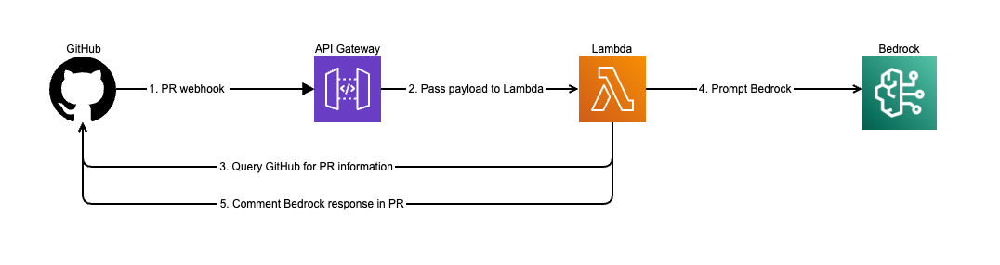

# pr-bot
A repo containing AWS resources used to provide feedback on GitHub pull requests using AWS Bedrock LLMs to
summarize the changes in the pull request, and provide code reviews based on LLM prompts.

# Architecture


# Branch strategy
`develop` --- deploys the devPrBot stack

`main` -- deploys the prodPrBot stack

Testing the URL:
```bash
curl -X POST -d '{"foo": "bar"}' -H 'Content-Type: application/json' https://<api_gateway_id>.execute-api.us-west-2.amazonaws.com/live/pr-review
```